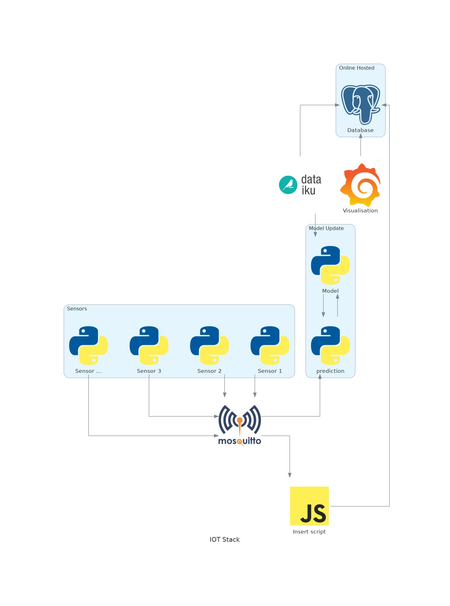

# Predictive Maintenance

## running

`docker-compose --env-file docker/docker-compose.env up --build`

## ports

|service|port|user|password|
|---|---|---|---|
|mqtt|10083|||
|grafana|10003|admin|admin|

## diagram



```
create table sensor_data(
    udi serial PRIMARY KEY,
    product_id VARCHAR(500) UNIQUE NOT NULL,
    type CHAR(1),
    air_temperature_k double precision,
    process_temperature_k double precision,
    rotational_speed_rpm double precision,
    torque_nm double precision,
    tool_wear_min bigint,
    machine_failure bigint,
    TWF bigint,
    HDF bigint,
    PWF bigint,
    OSF bigint,
    RNF bigint
);
```
